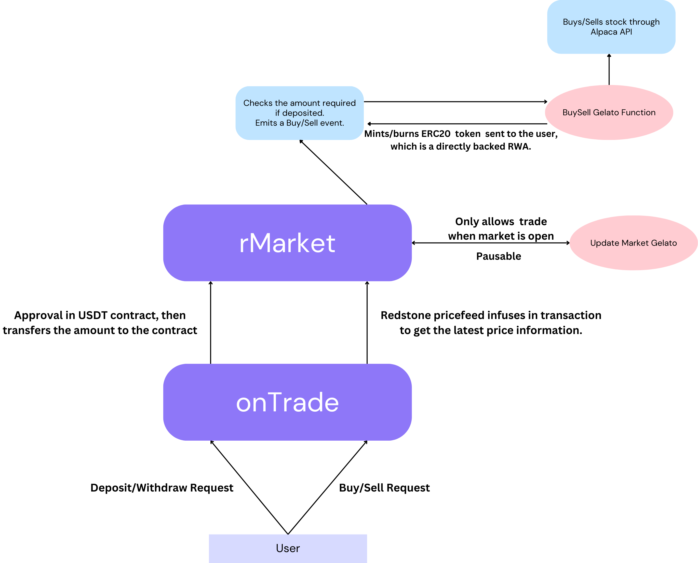

# onTrade

### Directly Backed Trading On-Chain: Real Assets, Real Security

Our project addresses a crucial gap in the current landscape of De-Fi on the blockchain. Traditional synthetic RWAs only mint tokens based on price feeds, creating an abstraction layer that does not connect directly to the underlying assets. Our solution takes a more direct approach by enabling RWAs that are directly backed by real assets.

By utilizing Gelato functions, our platform executes stock purchases off-chain, ensuring that the tokens you hold are genuinely backed by real stocks on the market. This enhances trust, transparency, and the overall value proposition of RWAs on-chain, effectively bridging the gap between traditional finance and blockchain technology.

#### Currently Deployed on Ethereum Sepolia and Supports the Following Stocks:
- [AAPL](https://sepolia.etherscan.io/address/0x602f5d30662895436bc2052a5db04a568ce745ee)
- [AMZN](https://sepolia.etherscan.io/address/0xd0d668a49f091f8c018c3dde05aab7ef198ebdb1)
- [MSFT](https://sepolia.etherscan.io/address/0x996f82e92eba4bf491aa9386649107a81ecbb3e1)
- [S&P500](https://sepolia.etherscan.io/address/0x99fdc2043639f2f286da21b8c55722e5bc43c0a7)

### All the contracts use a mock USDC on Sepolia, for testing feel free to mint it at [MINT](https://sepolia.etherscan.io/address/0x8e88dc97922f682acf3ce321be6b61a709eb8894#writeContract)

#### The flow of the Dapp is as follows:-
- Approve and deposit the suffcient amount of USDT to the contract.
- Select the stock and the correct amount.
- Redstone's core price feed wraps the transaction with its oracle data.
- After calling the `buyRStock` function, a `BuyRequest` gets emmitted.
- The event is picked up by Gelato's web3-function, which calls the Alpaca API to buy the respective stock in the exchange.
- It then excutes the `mintRStock` function, which mints the directly backed ERC20 of the RWA on-chain.
- In a similar manner, it can be sold and the USDT can be withdrawn. 



This repository includes the contract and Web3 functions, which need to be deployed separately for testing.

### For Contract:
```
$ forge init // Move the contract to foundry directory
$ forge install redstone-finance/redstone-oracles-monorepo --no-commit
$ forge install OpenZeppelin/openzeppelin-contracts@v4.9.5 --no-commit
```

### For web3-function
```
$ git clone https://github.com/gelatodigital/web3-functions-sdk.git
// Move the stocks and updates folder to web3-function
$ npx hardhat w3f-deploy stocks // to get the typescript function IPFS CID
```

### For web-app
```
$ npm i
$ npm run dev
```


### Environment Variables:
Environment variables are needed for Web3 functions as they use the [Alpaca API](https://app.alpaca.markets/signup) for stock trading.

#### Gelato Deployed Functions:
- [UpdateAAPL](https://app.gelato.network/functions/task/0x6c605ea798e32b7feb83275ee750db05bccd7fb634a80439d77f9f24e81955b6:11155111)
- [BuyAAPL](https://app.gelato.network/functions/task/0x67ad9c325c9a42e611bfd959966966fcb2def2840658f175f082743a32957fa8:11155111)
- [SellAAPL](https://app.gelato.network/functions/task/0xf2136e25ce5d7ea2e2ea796f21ed45192e22383fd283e5441e5942ff70856cce:11155111)
- [UpdateAMZN](https://app.gelato.network/functions/task/0x7f115fde3a4d03fa6d5b7c5332425c1777dfd8c9f8d582efcaea9904e5f41703:11155111)
- [BuyAMZN](https://app.gelato.network/functions/task/0x92c41019b6643920f44f2a2220a8f097dd23d7119132b78cd838a6258891afa5:11155111)
- [SellAMZN](https://app.gelato.network/functions/task/0x5f1a15fb577ef63172112f2a3503a8bc0391375f706095bca2be53e5aaaa251b:11155111)
- [UpdateMSFT](https://app.gelato.network/functions/task/0x51fd58ed9b26e74395d9a8577b55bce78a63ab8a373c56a202b4d136fe720bf7:11155111)
- [BuyMSFT](https://app.gelato.network/functions/task/0xd577b255e9be71491ea622b562448557894a2fa46c2d972789c79018426c2b06:11155111)
- [SellMSFT](https://app.gelato.network/functions/task/0x78a5ce1407b814f8ff0a2f795249c331dc574db6eec74d398686f4b366109317:11155111)
- [UpdateSPY](https://app.gelato.network/functions/task/0x520a14bf08161ad83e5399c8553c3c5fd548ea87f7b3e4c9386a1ccdac32ca37:11155111)
- [BuySPY](https://app.gelato.network/functions/task/0x992fcedb35d99d55105c3083a78bdc8a624760b7f6f023ad0401339a271dadde:11155111)
- [SellSPY](https://app.gelato.network/functions/task/0x7f0ad980b682ccd99bfe3f961e856efa5129ee2935eb8bb27b0257bb96237c72:11155111)

- **Market Function**: Manages pausing and unpausing of the contract based on market status.
- **Buy Function**: Listens for `BuyRequest` events, interacts with the Alpaca API to purchase stock, and mints the corresponding ERC20 token to the trader.
- **Sell Function**: Listens for `SellRequest` events, interacts with the Alpaca API to sell stock, and burns the corresponding ERC20 token from the trader.

### [Demo Video]()

## Built as a Mini-project at KIIT University
